# Documentation du Processus de Génération du Programme & Contenu

## 📋 Table des matières

1. [Vue d'ensemble](#vue-densemble)
2. [Diagramme de flux](#diagramme-de-flux)
3. [Architecture et composants](#architecture-et-composants)
4. [Étapes détaillées](#étapes-détaillées)
5. [Fichiers générés](#fichiers-générés)
6. [Configuration requise](#configuration-requise)

---

## Vue d'ensemble

Le système de génération automatise la création d'un programme de conférence complet et du contenu associé pour chaque auteur. Il s'appuie sur une base de données Omeka S, l'API Google Gemini pour l'intelligence artificielle, et transforme ces données en fichiers Quarto Markdown prêts à être compilés.

### Flux principal

```
Omeka API → Récupération → Distillation Contexte → Génération Fiches → Programme Final
   (données)     (RAW)      (IA/Gemini)         (IA/Gemini)       (.qmd)
```

---

## Diagramme de flux

```mermaid
graph TD
    Start([Démarrage<br/>genere_programme_to_quarto.php]) --> OmekaEvent["🔗 Récupération de l'événement<br/>(Omeka API)"]
    
    OmekaEvent --> CheckRaw{Contenu brut<br/>du site<br/>existe?}
    CheckRaw -->|Non| FetchRaw["📥 ContextDistiller::<br/>fetchRawContent<br/>(Parse HTML)"]
    CheckRaw -->|Oui| LoadRaw["📖 Charger le fichier<br/>rawtext_*.txt"]
    
    FetchRaw --> SaveRaw["💾 Sauvegarder<br/>rawtext_*.txt"]
    SaveRaw --> CheckContext{Contexte<br/>distillé<br/>existe?}
    LoadRaw --> CheckContext
    
    CheckContext -->|Non| DistillContext["🤖 ContextDistiller::<br/>distillContext<br/>(Gemini API)"]
    CheckContext -->|Oui| LoadContext["📖 Charger le fichier<br/>context_*.json"]
    
    DistillContext --> SaveContext["💾 Sauvegarder<br/>context_*.json"]
    SaveContext --> ParseContext["🔍 Extraire contexte,<br/>axes et biblio"]
    LoadContext --> ParseContext
    
    ParseContext --> CreateGen["✅ Instancier<br/>ResumeGenerator"]
    CreateGen --> FetchAuthors["📋 Récupérer liste CSV<br/>des auteurs"]
    
    FetchAuthors --> LoopStart{Pour chaque<br/>auteur}
    
    LoopStart -->|Auteur N| FetchAuteur["🔗 Récupération auteur<br/>depuis Omeka"]
    FetchAuteur --> GeneratePrompt["📝 Construire prompt<br/>personnalisé"]
    GeneratePrompt --> CallGemini["🤖 Appel Gemini API<br/>(gemini-3-pro-preview)"]
    
    CallGemini --> ParseOutput["🔍 Parser résumé IA<br/>(frontmatter Quarto)"]
    ParseOutput --> ExtractTitle["🏷️ Extraire titre<br/>de la proposition"]
    ExtractTitle --> SaveAuteur["💾 Sauvegarder<br/>auteur_*.qmd"]
    
    ParseOutput --> CollectProps["📦 Collector données<br/>(auteur, titre)"]
    SaveAuteur --> CollectProps
    
    CollectProps --> LoopCheck{"Auteurs<br/>restants?"}
    LoopCheck -->|Oui| LoopStart
    LoopCheck -->|Non| CreateProgram["🏗️ Instancier<br/>ProgrammeGenerator"]
    
    CreateProgram --> ParseDates["📅 Parser dates<br/>de l'événement"]
    ParseDates --> SplitProps["📊 Diviser propositions<br/>par jour/bloc"]
    
    SplitProps --> GenerateSchedule["⏰ Générer planning<br/>avec horaires"]
    GenerateSchedule --> AddBreaks["☕ Insérer pauses<br/>et déjeuner"]
    AddBreaks --> GenerateLinks["🔗 Générer liens<br/>vers fichiers auteurs"]
    
    GenerateLinks --> SaveProgram["💾 Sauvegarder<br/>programme.qmd"]
    SaveProgram --> Success(["✅ Succès!<br/>Fichiers générés"])
    
    style Start fill:#90EE90
    style Success fill:#90EE90
    style OmekaEvent fill:#87CEEB
    style FetchRaw fill:#FFB6C1
    style DistillContext fill:#FFD700
    style CallGemini fill:#FFD700
    style SaveAuteur fill:#98FB98
    style SaveProgram fill:#98FB98
```



---

## Architecture et composants

### 1. **ContextDistiller.php**
Classe responsable de l'analyse et de la distillation du contexte du colloque.

**Fonctions principales :**
- `fetchRawContent($url)` : Parse le HTML du site, supprime les balises inutiles (scripts, styles, nav, footer), extrait le texte brut
- `distillContext($rawText)` : Envoie le texte à Google Gemini avec un "Golden Prompt" pour extraire :
  - La problématique centrale
  - 6 axes de recherche principaux
  - La bibliographie complète avec concepts associés

**Sorties :**
- `rawtext_*.txt` : Contenu textuel brut du site
- `context_*.json` : Contexte structure (problématique, axes, biblio)

### 2. **ResumeGenerator.php**
Classe qui génère les fiches auteur individuelles avec propositions.

**Fonctions principales :**
- `generate($auteur)` : Pour chaque auteur :
  - Récupère les données depuis Omeka (affiliations, publications, mots-clés)
  - Construit un prompt personnalisé incluant le contexte du colloque
  - Appelle Google Gemini (gemini-3-pro-preview)
  - Génère un document Quarto Markdown avec frontmatter
  - Gère la bibliographie en BibTeX (récupération depuis HAL/DOI)

**Gestion des publications :**
- `fetchBibtexFromHal($halId)` : Récupère le BibTeX depuis l'API HAL
- `fetchBibtexFromDoi($doi)` : Récupère le BibTeX depuis l'API DOI.org
- `isDuplicate($newEntry)` : Vérifie les doublons dans le fichier `.bib`

**Sorties :**
- `auteur_*.qmd` : Fiche auteur au format Quarto
- `referenceAuteurs.bib` : Bibliographie consolidée en BibTeX

### 3. **ProgrammeGenerator.php**
Classe qui synthétise les fiches auteur en programme global de conférence.

**Fonctions principales :**
- `generate()` : Crée le programme avec :
  - Division des propositions en 3 jours (Conceptions/Créations/Expérimentations)
  - Calcul automatique des horaires (slots de 30 min, pauses toutes les 4 interventions)
  - Insertion des repas et accueil/clôture
  - Génération de tables HTML avec liens vers les fiches auteur

**Paramètres configurables :**
- `$slotDuration` : 30 minutes par défaut
- `$pauseDuration` : 30 minutes
- `$interventionsBeforePause` : 4 interventions avant pause
- `$startTime` : 09:00
- `$lunchTime` : 12:30
- `$lunchDuration` : 90 minutes

**Sorties :**
- `programme.qmd` : Programme complet en Quarto Markdown

### 4. **genere_programme_to_quarto.php**
Script orchestrateur qui coordonne l'ensemble du processus.

---

## Étapes détaillées

### **Étape 1 : Récupération de l'événement (Omeka)**
- URL API : `https://humanum-p8.fr/omk_paragraphe/api/items/54151`
- Récupère : titre, dates, lieu, URL du site de l'événement
- Utilise : fonction `fetchOmekaJson()`

### **Étape 2 : Extraction du contexte du site**
**Condition :** Si `rawtext_*.txt` n'existe pas
- `ContextDistiller::fetchRawContent()` :
  - Charge le HTML du site de l'événement
  - Parse via DOMDocument/DOMXPath
  - Supprime : `<script>`, `<style>`, `<nav>`, `<footer>`, `<header>`
  - Nettoie les espaces multiples
- Sauvegarde : `auteurs_quarto/rawtext_*.txt`

### **Étape 3 : Distillation du contexte (IA)**
**Condition :** Si `context_*.json` n'existe pas
- `ContextDistiller::distillContext()` appelle Gemini avec Golden Prompt :

```
"Tu es un expert en analyse documentaire. 
Analyse le texte et extrais :
1. Problématique centrale
2. 6 axes de recherche principaux  
3. Bibliographie avec concepts associés

Réponse en JSON : {contexte: ..., axes: ..., biblio: ...}"
```

- API : `gemini-3-pro-preview`
- Sauvegarde : `auteurs_quarto/context_*.json`

### **Étape 4 : Génération des fiches auteur**
**Pour chaque auteur :**

1. **Récupération depuis Omeka** :
   - Item ID depuis CSV bulk export
   - Données : titre, affiliations, publications, mots-clés

2. **Construction du prompt** :
   - Include contexte du colloque
   - Include axes thématiques
   - Include bibliographie
   - Include données auteur (CV, publications)
   - Template : "Propose une contribution sur [thème]"

3. **Appel à l'IA (Gemini)** :
   - Model : `gemini-3-pro-preview`
   - Génère : proposition structurée en Quarto Markdown

4. **Gestion de la bibliographie** :
   - Extrait DOI/HAL des publications
   - Récupère BibTeX via APIs externes
   - Fusionne dans `referenceAuteurs.bib`
   - Détecte et ignore les doublons

5. **Sauvegarde** :
   - Fichier : `auteurs_quarto/auteur_*.qmd`
   - Format : Quarto avec frontmatter YAML + contenu Markdown

### **Étape 5 : Génération du programme**
**Dans `ProgrammeGenerator::generate()` :**

1. **Division en jours** :
   ```php
   $jours = [
       "Conceptions" => array_slice(0, split),
       "Créations" => array_slice(split, split),
       "Expériementations" => array_slice(split*2)
   ]
   ```

2. **Calcul des horaires** :
   - Début : 09:00
   - Slots : 30 min par intervention
   - Pauses : 30 min après 4 interventions
   - Déjeuner : 12:30 - 14:00 (90 min)

3. **Génération du Markdown** :
   - En-tête YAML (titre, sous-titre, toc)
   - Note explicative du processus
   - Tableau HTML par jour/bloc avec :
     - Horaires
     - Type (Communication/Pause/Déjeuner)
     - Intervenant + Titre
     - Lien vers `auteurs_quarto/auteur_*.qmd`

4. **Sauvegarde** :
   - Fichier : `programme.qmd`
   - Format : Quarto Markdown

---

## Fichiers générés

### Dossier `auteurs_quarto/`

| Fichier | Type | Contenu |
|---------|------|---------|
| `rawtext_*.txt` | TXT | Contenu textuel brut du site |
| `context_*.json` | JSON | Contextual structuré (problématique, axes, biblio) |
| `prompt_*.txt` | TXT | Prompt utilisé pour générer la fiche auteur |
| `auteur_*.qmd` | Quarto | Fiche auteur avec proposition (frontmatter + contenu) |
| `resume_*.json` | JSON | Réponse complète de Gemini (pour débogage) |
| `referenceAuteurs.bib` | BibTeX | Bibliographie consolidée |

### Racine du projet

| Fichier | Type | Contenu |
|---------|------|---------|
| `programme.qmd` | Quarto | Programme global du colloque |

---

## Configuration requise

### Fichiers de configuration

1. **`key.php`** (non fourni pour sécurité)
   ```php
   <?php
   $apiKey = "YOUR_GOOGLE_GEMINI_API_KEY";
   ?>
   ```

2. **`_quarto.yml`** : Configuration Quarto pour le rendu

3. **CSV des auteurs** : À générer depuis Omeka
   - Format : `liste_auteurs.csv` ou bulk export
   - Colonnes : Item ID, Titre, ...

### Dépendances externes

- **Google Gemini API** : `gemini-3-pro-preview`
- **Omeka S API** : Instance locale ou distante
- **APIs pour BibTeX** :
  - HAL : `https://api.archives-ouvertes.fr/`
  - DOI.org : `https://doi.org/`
- **PHP** : ≥ 7.4 (DOMDocument, cURL)

### Paramètres Omeka

| Paramètre | Valeur | Note |
|-----------|--------|------|
| URL Base | `http://localhost/omk_paragraphe` | À adapter |
| Item Event | `54151` | ID de l'événement colloque |
| CSV Export | Généré depuis Omeka | Contient liste des auteurs |

### Paramètres Quarto

```yaml
# _quarto.yml
project:
  type: website
  output-dir: docs
format:
  html:
    theme: cosmo
    toc: true
```

---

## Flux de traitement simplifié

```
┌─────────────────────────────────────────────────┐
│  DÉMARRAGE                                       │
│  genere_programme_to_quarto.php                 │
└──────────────────┬──────────────────────────────┘
                   │
        ┌──────────┴──────────┐
        │                     │
   ┌────▼─────┐        ┌─────▼────┐
   │ Contexte │        │  Auteurs │
   │ (1 seul) │        │(plusieurs)│
   └────┬─────┘        └─────┬────┘
        │                    │
   ┌────▼──────────────────┐     │
   │ContextDistiller::     │     │
   │ • fetchRawContent()   │     │
   │ • distillContext()    │     │
   │ (Gemini API)          │     │
   └────┬──────────────────┘     │
        │                        │
        ▼                        │
   context_*.json                │
        │                        │
        │                    ┌───▼─────────────────┐
        │                    │ BOUCLE POUR chaque  │
        │                    │ ResumeGenerator::   │
        │                    │ • generate()        │
        │                    │ (Gemini API)        │
        │                    │ • fetchBibtex*()    │
        │                    │ • isDuplicate()     │
        │                    └───┬─────────────────┘
        │                        │
        │                        ▼
        │                    auteur_*.qmd
        │                    ref_*.bib
        │                    resume_*.json
        │                        │
        └────────────┬───────────┘
                     │
                ┌────▼──────────────────┐
                │ ProgrammeGenerator::   │
                │ • generate()           │
                │ • getSlug()            │
                │ • getPeriodeStr()      │
                │ • getDate()            │
                └────┬──────────────────┘
                     │
                     ▼
                programme.qmd
                     │
                     ▼
         ┌───────────────────────┐
         │ QUARTO RENDER         │
         │ quarto render         │
         └───────────────────────┘
                     │
                     ▼
         ┌───────────────────────┐
         │ SITE STATIC HTML      │
         │ docs/ folder          │
         └───────────────────────┘
```

---

## Points clés du processus

### ✨ Avantages de cette approche

- **Automatisation complète** : De la donnée brute au site compilé
- **IA générative** : Génération de contenu personnalisé avec Gemini
- **Modularité** : Chaque classe a une responsabilité unique
- **Réutilisabilité** : Cache des fichiers JSON/TXT pour éviter les appels redondants
- **Flexibilité** : Paramètres de planification facilement ajustables
- **Traçabilité** : Stockage des prompts et réponses complètes

### ⚠️ Considérations

- **Coûts API** : Chaque auteur = 1 appel Gemini (frais de token)
- **Dépendances critiques** : Omeka S et Gemini API doivent être accessibles
- **Manuelle réactive** : Les fichiers `.json` et `.qmd` doivent être validés avant rendu final
- **Limites de contexte** : Texte brut limité à 50 000 caractères pour Gemini
- **Rate limiting** : Respecter les limites de l'API Gemini

---

## Exemple de commande d'exécution

```bash
# Depuis la racine du projet
php genere_programme_to_quarto.php

# Puis compiler le site
quarto render

# Visualiser le résultat
open docs/index.html
```

---

## Fichiers de référence

```
/Users/samszo/Sites/frontieres-numeriques_2026/
├── ContextDistiller.php           # Distillation contexte
├── ResumeGenerator.php            # Génération fiches auteur
├── ProgrammeGenerator.php         # Génération programme
├── genere_programme_to_quarto.php # Orchestrateur
├── key.php                        # Clés API (non fourni)
├── auteurs_quarto/               # Fiches auteur générées
│   ├── rawtext_*.txt
│   ├── context_*.json
│   ├── auteur_*.qmd
│   └── referenceAuteurs.bib
├── programme.qmd                 # Programme compilé
├── index.qmd                      # Page d'accueil
├── _quarto.yml                    # Config Quarto
└── docs/                          # Sortie HTML générée
```

---

**Documentation mise à jour** : 1er mars 2026  
**Dernière version du processus** : Utilisation de `gemini-3-pro-preview`
