# Documentation du Processus de Génération du Programme & Contenu

## 📋 Table des matières

1. [Vue d'ensemble](#vue-densemble)
2. [Diagramme de flux](#diagramme-de-flux)
3. [Architecture et composants](#architecture-et-composants)
4. [Étapes détaillées](#étapes-détaillées)
5. [Fichiers générés](#fichiers-générés)
6. [Configuration requise](#configuration-requise)

---

## Vue d'ensemble

Le système de génération automatise la création d'un programme de conférence complet et du contenu associé pour chaque auteur. Il s'appuie sur une base de données Omeka S, l'API Google Gemini pour l'intelligence artificielle, et transforme ces données en fichiers Quarto Markdown prêts à être compilés.

### Flux principal

```
Omeka API → Récupération → Distillation Contexte → Génération Fiches → Programme Final
   (données)     (RAW)      (IA/Gemini)         (IA/Gemini)       (.qmd)
```

---

## Diagramme de flux

```mermaid
graph TD
    Start([Démarrage<br/>genere_programme_to_quarto.php]) --> OmekaEvent["🔗 Récupération de l'événement<br/>(Omeka API)"]
    
    OmekaEvent --> GetSite["🔗 Récupération du site<br/>Omeka associé"]
    GetSite --> CheckRaw{Contenu brut<br/>du site<br/>existe?}
    CheckRaw -->|Non| FetchRaw["📥 ContextDistiller::<br/>fetchRawContent<br/>(Parse HTML)"]
    CheckRaw -->|Oui| LoadRaw["📖 Charger le fichier<br/>rawtext_*.txt"]
    
    FetchRaw --> SaveRaw["💾 Sauvegarder<br/>rawtext_*.txt"]
    SaveRaw --> CheckContext{Contexte<br/>distillé<br/>existe?}
    LoadRaw --> CheckContext
    
    CheckContext -->|Non| DistillContext["🤖 ContextDistiller::<br/>distillContext<br/>(Gemini API)"]
    CheckContext -->|Oui| LoadContext["📖 Charger le fichier<br/>context_*.json"]
    
    DistillContext --> SaveContext["💾 Sauvegarder<br/>context_*.json"]
    SaveContext --> ParseContext["🔍 Extraire CONTEXTE,<br/>AXES, BIBLIO"]
    LoadContext --> ParseContext
    
    ParseContext --> CreateGen["✅ Instancier<br/>ResumeGenerator<br/>(avec site slug)"]
    CreateGen --> FetchAuthors["📋 Récupérer liste CSV<br/>des auteurs<br/>(depuis bibo:authorList)"]
    
    FetchAuthors --> LoopStart{Pour chaque<br/>auteur}
    
    LoopStart -->|Auteur N| FetchAuteur["🔗 Récupération auteur<br/>depuis Omeka"]
    FetchAuteur --> CheckFilter{"Projet en cours<br/>sur<br/>sciencesconf.org?"}
    CheckFilter -->|Oui| SkipAutor["⏭️ IGNORER auteur<br/>(déjà en projet)"]
    CheckFilter -->|Non| GeneratePrompt["📝 Construire prompt<br/>personnalisé<br/>(contexte + auteur)"]
    SkipAutor --> LoopCheck
    GeneratePrompt --> CallGemini["🤖 Appel Gemini API<br/>(gemini-3-pro-preview)"]
    
    CallGemini --> CheckMd{"Réponse<br/>valide?"}
    CheckMd -->|Vide| LoopCheck
    CheckMd -->|Oui| ParseOutput["🔍 Parser résumé IA<br/>(frontmatter Quarto)"]
    ParseOutput --> ExtractTitle["🏷️ Extraire titre<br/>de la proposition"]
    ExtractTitle --> SaveAuteur["💾 Sauvegarder<br/>auteur_*.qmd"]
    
    SaveAuteur --> CollectProps["📦 Collecter données<br/>(auteur, titre)"]
    
    CollectProps --> LoopCheck{"Auteurs<br/>restants?"}
    LoopCheck -->|Oui| LoopStart
    LoopCheck -->|Non| CreateProgram["🏗️ Instancier<br/>ProgrammeGenerator<br/>(avec fileNameContext)"]
    
    CreateProgram --> ParseDates["📅 Parser dates<br/>de l'événement"]
    ParseDates --> SplitProps["📊 Diviser propositions<br/>par jour/bloc"]
    
    SplitProps --> GenerateSchedule["⏰ Générer planning<br/>avec horaires"]
    GenerateSchedule --> AddBreaks["☕ Insérer pauses<br/>et déjeuner"]
    AddBreaks --> GenerateLinks["🔗 Générer liens<br/>vers fichiers auteurs"]
    
    GenerateLinks --> SaveProgram["💾 Sauvegarder<br/>programme.qmd"]
    SaveProgram --> Success(["✅ Succès!<br/>Fichiers générés"])
    
    style Start fill:#90EE90
    style Success fill:#90EE90
    style OmekaEvent fill:#87CEEB
    style GetSite fill:#87CEEB
    style FetchRaw fill:#FFB6C1
    style DistillContext fill:#FFD700
    style CallGemini fill:#FFD700
    style CheckFilter fill:#FFB6C1
    style SkipAutor fill:#FF6B6B
    style SaveAuteur fill:#98FB98
    style SaveProgram fill:#98FB98
```



---

## Architecture et composants

### 1. **ContextDistiller.php**
Classe responsable de l'analyse et de la distillation du contexte du colloque.

**Fonctions principales :**
- `fetchRawContent($url)` : Parse le HTML du site, supprime les balises inutiles (scripts, styles, nav, footer), extrait le texte brut
- `distillContext($rawText)` : Envoie le texte à Google Gemini avec un "Golden Prompt" pour extraire :
  - La problématique centrale
  - 6 axes de recherche principaux
  - La bibliographie complète avec concepts associés

**Sorties :**
- `rawtext_*.txt` : Contenu textuel brut du site
- `context_*.json` : Contexte structure (problématique, axes, biblio)

### 2. **ResumeGenerator.php**
Classe qui génère les fiches auteur individuelles avec propositions.

**Constructeur :**
```php
public function __construct($apiKey, $context, $omkItemConf, $outputFolder, $omkSite)
```
- `$apiKey` : Clé API Google Gemini
- `$context` : Array avec clés `CONTEXTE`, `AXES`, `BIBLIO` (extraites du JSON distillé)
- `$omkItemConf` : Item Omeka de l'événement (pour métadonnées)
- `$outputFolder` : Dossier de sortie (`auteurs_quarto`)
- `$omkSite` : Information du site Omeka associé

**Fonctions principales :**
- `generate($auteur)` : Pour chaque auteur :
  - Récupère les données depuis Omeka (affiliations, publications, mots-clés)
  - Construit un prompt personnalisé incluant le contexte du colloque et le site slug
  - Appelle Google Gemini (gemini-3-pro-preview)
  - Génère un document Quarto Markdown avec frontmatter
  - Gère la bibliographie en BibTeX (récupération depuis HAL/DOI)
  - Retourne la fiche générée ou `false` en cas d'erreur

**Gestion des publications :**
- `fetchBibtexFromHal($halId)` : Récupère le BibTeX depuis l'API HAL
- `fetchBibtexFromDoi($doi)` : Récupère le BibTeX depuis l'API DOI.org
- `isDuplicate($newEntry)` : Vérifie les doublons dans le fichier `.bib`

**Sorties :**
- `auteur_*.qmd` : Fiche auteur au format Quarto
- `referenceAuteurs.bib` : Bibliographie consolidée en BibTeX

### 3. **ProgrammeGenerator.php**
Classe qui synthétise les fiches auteur en programme global de conférence.

**Constructeur :**
```php
public function __construct($propositions, $siteItem, $fileNameContext)
```
- `$propositions` : Array avec métadonnées de chaque auteur `["auteur"=>..., "titre"=>...]`
- `$siteItem` : Item Omeka de l'événement (pour dates, lieu, titre)
- `$fileNameContext` : Nom du fichier du contexte distillé (utilisé dans la documentation)

**Fonctions principales :**
- `generate()` : Crée le programme avec :
  - Division des propositions en 3 jours (Conceptions/Créations/Expérimentations)
  - Calcul automatique des horaires (slots de 30 min, pauses toutes les 4 interventions)
  - Insertion des repas et accueil/clôture
  - Génération de tables HTML avec liens vers les fiches auteur
  - Callout d'avertissement sur le statut provisoire du programme
  - Section expliquant le processus de génération

**Paramètres configurables :**
- `$slotDuration` : 30 minutes par défaut
- `$pauseDuration` : 30 minutes
- `$interventionsBeforePause` : 4 interventions avant pause
- `$startTime` : 09:00
- `$lunchTime` : 12:30
- `$lunchDuration` : 90 minutes

**Sorties :**
- `programme.qmd` : Programme complet en Quarto Markdown

### 4. **genere_programme_to_quarto.php**
Script orchestrateur qui coordonne l'ensemble du processus.

**Configuration :**
- URL Omeka locale : `http://localhost/omk_paragraphe` (développement)
- URL Omeka distante : `https://humanum-p8.fr/paragraphe` (production)
- SSL vérifié : Non (accepte certificats auto-signés)

**Flux d'exécution :**
1. Récupère l'événement depuis Omeka (`items/54151`)
2. Récupère le site Omeka associé (`o:site[0]["@id"]`)
3. Récupère le titre du projet courant (`foaf:currentProject`)
4. Distille le contexte du site de l'événement
5. Instancie `ResumeGenerator` avec le contexte et le site
6. Récupère le CSV via cURL (résout les certificats HTTPS)
   - Parse le CSV ligne par ligne avec `str_getcsv()`
7. **Boucle sur chaque auteur du CSV**
   - **Filtre intelligent** : Si auteur a le projet courant
     - Charge le fichier `.qmd` existant (édité manuellement)
     - N'appelle pas l'IA (économise jetons/budget)
   - **Sinon** : Génère une nouvelle fiche avec IA
   - Collecte métadonnées : `["id", "auteur", "titre", "page"]`
8. Instancie `ProgrammeGenerator` avec les propositions
9. Génère le programme final
10. **Exporte les métadonnées en CSV** : `programme.csv`

---

## Étapes détaillées

### **Étape 1 : Récupération de l'événement (Omeka)**
- URL API : `https://humanum-p8.fr/paragraphe/api/items/54151`
- Récupère :
  - Titre, dates, lieu, URL du site de l'événement
  - URL du site Omeka associé (`o:site[0]["@id"]`)
  - Titre du projet courant (`foaf:currentProject[0]["@value"]`)
  - URL du fichier CSV de la liste des auteurs (`bibo:authorList[0]["@id"]`)
- **Gestion SSL** : Désactive vérification si certificat auto-signé
- Utilise : fonction `fetchOmekaJson($baseUrl, $endpoint, $url="")` (accepte directement une URL complète)

### **Étape 1b : Récupération du CSV des auteurs**
- **Via cURL** (résout certificats HTTPS auto-signés)
  - URL : Depuis `bibo:authorList[0]["@id"]` (dynamique)
  - Option SSL : `CURLOPT_SSL_VERIFYPEER => false`
- **Parsing** : `str_getcsv()` ligne par ligne
  - Première ligne : headers ignorée
  - Autres lignes : ID auteur en colonne 0
- **Stockage** : Array `$auteurs[]` avec IDs

### **Étape 2 : Extraction du contexte du site**
**Condition :** Si `rawtext_*.txt` n'existe pas
- `ContextDistiller::fetchRawContent()` :
  - Charge le HTML du site de l'événement
  - Parse via DOMDocument/DOMXPath
  - Supprime : `<script>`, `<style>`, `<nav>`, `<footer>`, `<header>`
  - Nettoie les espaces multiples
- Sauvegarde : `auteurs_quarto/rawtext_*.txt`

### **Étape 3 : Distillation du contexte (IA)**
**Condition :** Si `context_*.json` n'existe pas
- `ContextDistiller::distillContext()` appelle Gemini avec Golden Prompt :

```
"Tu es un expert en analyse documentaire. 
Analyse le texte et extrais :
1. Problématique centrale (CONTEXTE)
2. 6 axes de recherche principaux (AXES)
3. Bibliographie avec concepts associés (BIBLIO)

Réponse en JSON : {CONTEXTE: [...], AXES: [...], BIBLIO: [...]}"
```

- API : `gemini-3-pro-preview`
- Structure JSON externe : `candidates[0].content.parts[0].text` contenant un bloc JSON interne
- Sauvegarde : `auteurs_quarto/context_*.json`

### **Étape 4 : Génération des fiches auteur**
**Pour chaque auteur :**

**Filtre d'exclusion :**
- Vérifie si l'auteur a un projet en cours **correspondant au projet courant de l'événement** (`foaf:currentProject`)
- Si oui → **Récupère** le fichier `.qmd` existant (édité manuellement)
  - Pas de nouvelle génération IA
  - Le fichier local est conservé
- Si non → Génère une nouvelle fiche IA
- Message :
  - Trouvé : `"Pas de Traitement : [auteur]"` (utilise version existante)
  - Nouveau : `"Traitement : [auteur]"` (génère IA)

**Processus (si non filtré) :**

1. **Récupération depuis Omeka** :
   - Item ID depuis CSV bulk export
   - Données : titre, affiliations, publications, mots-clés
   - Annotations : statuts, dates, références

2. **Construction du prompt** :
   - Include contexte du colloque (`CONTEXTE`, `AXES`, `BIBLIO`)
   - Include slug du site Omeka (`$omkSite`)
   - Include données auteur complet
   - Template : "Propose une contribution sur [thème du colloque]"

3. **Appel à l'IA (Gemini)** :
   - Model : `gemini-3-pro-preview`
   - Génère : proposition structurée en Quarto Markdown
   - Vérifie que la réponse n'est pas vide avec `if($md)`

4. **Gestion de la bibliographie** :
   - Extrait DOI/HAL des publications
   - Récupère BibTeX via APIs externes (HAL, DOI.org)
   - Fusionne dans `referenceAuteurs.bib`
   - Détecte et ignore les doublons avec `isDuplicate()`

5. **Extraction du titre** :
   - Regex : `/\*\*Titre\s*:\s*(.+?)\*\*/s`
   - Pour extraction depuis le contenu généré par IA

6. **Sauvegarde** :
   - **Si nouveau** : 
     - Fichier : `auteurs_quarto/auteur_*.qmd`
     - Format : Quarto avec frontmatter YAML + contenu Markdown
   - **Si existant** (filtre positif) :
     - Charge depuis disque (déjà édité manuellement)
     - Saute la génération IA
   - Collecte métadonnées : `["id"=>[oid], "auteur"=>..., "titre"=>..., "page"=>...]`

### **Étape 5 : Export des métadonnées en CSV**

**Nouveau depuis 4 mars 2026**

**Création de `programme.csv`** :
- Colonnes : `id`, `auteur`, `titre`, `page`
- Une ligne par auteur
- Chemin : `auteurs_quarto/programme.csv`
- Utilisé pour : 
  - Synchronisation avec Omeka
  - Tracking des modifications apportées aux fiches
  - Audit des propositions

**Format :**
```csv
id,auteur,titre,page
72730,Samuel Szoniecky,Proposition 1,auteurs_quarto/samuel_szoniecky.html
72731,Imad Saleh,Proposition 2,auteurs_quarto/imad_saleh.html
```

### **Étape 6 : Génération du programme**
**Dans `ProgrammeGenerator::generate()` :**

1. **Division en jours** :
   ```php
   $jours = [
       "Conceptions" => array_slice(0, split),
       "Créations" => array_slice(split, split),
       "Expériementations" => array_slice(split*2)
   ]
   ```

2. **Calcul des horaires** :
   - Début : 09:00
   - Slots : 30 min par intervention
   - Pauses : 30 min après 4 interventions
   - Déjeuner : 12:30 - 14:00 (90 min)

3. **Génération du Markdown** :
   - En-tête YAML (titre, sous-titre, toc)
   - Note explicative du processus
   - Tableau HTML par jour/bloc avec :
     - Horaires
     - Type (Communication/Pause/Déjeuner)
     - Intervenant + Titre
     - Lien vers `auteurs_quarto/auteur_*.qmd`

4. **Sauvegarde** :
   - Fichier : `programme.qmd`
   - Format : Quarto Markdown

---

## Fichiers générés et métadonnées

| Fichier | Type | Contenu |
|---------|------|---------|
| `rawtext_*.txt` | TXT | Contenu textuel brut du site |
| `context_*.json` | JSON | Contextual structuré (problématique, axes, biblio) |
| `prompt_*.txt` | TXT | Prompt utilisé pour générer la fiche auteur |
| `auteur_*.qmd` | Quarto | Fiche auteur avec proposition (frontmatter + contenu) |
| `resume_*.json` | JSON | Réponse complète de Gemini (pour débogage) |
| `referenceAuteurs.bib` | BibTeX | Bibliographie consolidée |
| `programme.csv` | CSV | Métadonnées des propositions (id, auteur, titre, page) |

**Racine du projet**

| Fichier | Type | Contenu |
|---------|------|---------|
| `programme.qmd` | Quarto | Programme global du colloque |

---

## Configuration requise

### Fichiers de configuration

1. **`key.php`** (non fourni pour sécurité)
   ```php
   <?php
   $apiKey = "YOUR_GOOGLE_GEMINI_API_KEY";
   ?>
   ```

2. **`_quarto.yml`** : Configuration Quarto pour le rendu

3. **CSV des auteurs** : À générer depuis Omeka
   - Format : `liste_auteurs.csv` ou bulk export
   - Colonnes : Item ID, Titre, ...

### Dépendances externes

- **Google Gemini API** : `gemini-3-pro-preview`
- **Omeka S API** : Instance locale ou distante
- **APIs pour BibTeX** :
  - HAL : `https://api.archives-ouvertes.fr/`
  - DOI.org : `https://doi.org/`
- **PHP** : ≥ 7.4 (DOMDocument, cURL)

### Paramètres Omeka

| Paramètre | Valeur | Note |
|-----------|--------|------|
| URL Base Local | `http://localhost/omk_paragraphe` | Développement (sans SSL) |
| URL Base Distant | `https://humanum-p8.fr/paragraphe` | Production (SSL auto-signé) |
| Item Event | `54151` | ID de l'événement colloque |
| Site associé | `o:site[0]["@id"]` | URL du site Omeka associé |
| Projet courant | `foaf:currentProject[0]["@value"]` | Titre du projet (pour filtre) |
| Liste auteurs | `bibo:authorList[0]["@id"]` | URL du CSV bulk export |
| Location | `curation:location[0]["@value"]` | Lieu de l'événement |
| Dates | `dcterms:date[0]["@value"]` | Format : "YYYY-MM-DD/YYYY-MM-DD" |
| Homepage | `foaf:homepage[0]["@id"]` | URL du site de l'événement |
| Homepage | `foaf:homepage[0]["@id"]` | URL du site de l'événement |

### Paramètres Quarto

```yaml
# _quarto.yml
project:
  type: website
  output-dir: docs
format:
  html:
    theme: cosmo
    toc: true
```

---

## Flux de traitement simplifié

```
┌─────────────────────────────────────────────────┐
│  DÉMARRAGE                                       │
│  genere_programme_to_quarto.php                 │
└──────────────────┬──────────────────────────────┘
                   │
        ┌──────────┴──────────────────┐
        │                             │
   ┌────▼─────┐              ┌───────▼────────┐
   │ Contexte │              │  Auteurs & Site │
   │ (1 seul) │              │ (plusieurs)     │
   └────┬─────┘              └───────┬────────┘
        │                            │
   ┌────▼──────────────────┐         │
   │ ContextDistiller::     │         │
   │ • fetchRawContent()   │         │
   │ • distillContext()    │         │
   │ (Gemini API)          │         │
   └────┬──────────────────┘         │
        │                            │
        ▼                            │
   context_*.json                    │
        │                            │
        │                      ┌─────▼──────────────────┐
        │                      │ BOUCLE POUR chaque     │
        │                      │ auteur:                │
        │                      │ ├─ FILTRE              │
        │                      │ │ (sciencesconf.org?)  │
        │                      │ │ │                    │
        │                      │ │ ├─ OUI → IGNORER     │
        │                      │ │ ├─ NON ↓             │
        │                      │ │                      │
        │                      │ ├─ ResumeGenerator::   │
        │                      │ │ • generate()        │
        │                      │ │ (Gemini API)        │
        │                      │ │ • fetchBibtex*()    │
        │                      │ │ • isDuplicate()     │
        │                      │ └────────┬────────────┘
        │                                 │
        │                                 ▼
        │                            auteur_*.qmd
        │                            ref_*.bib
        │                            resume_*.json
        │                                 │
        └─────────────────┬───────────────┘
                          │
                     ┌────▼──────────────────┐
                     │ ProgrammeGenerator::   │
                     │ • generate()           │
                     │ • getSlug()            │
                     │ • getPeriodeStr()      │
                     │ • getDate()            │
                     └────┬──────────────────┘
                          │
                          ▼
                     programme.qmd
                          │
                          ▼
              ┌───────────────────────┐
              │ QUARTO RENDER         │
              │ quarto render         │
              └───────────────────────┘
                          │
                          ▼
              ┌───────────────────────┐
              │ SITE STATIC HTML      │
              │ docs/ folder          │
              └───────────────────────┘
```

---

## Points clés du processus

### ✨ Avantages de cette approche

- **Automatisation complète** : De la donnée brute au site compilé
- **IA générative** : Génération de contenu personnalisé avec Gemini
- **Modularité** : Chaque classe a une responsabilité unique
- **Réutilisabilité** : Cache des fichiers JSON/TXT pour éviter les appels redondants
- **Flexibilité** : Paramètres de planification facilement ajustables
- **Traçabilité** : Stockage des prompts et réponses complètes
- **Filtre intelligent** : Exclusion automatique des auteurs en projet courant (charge version existante)
- **Scalabilité** : Générateurs multiples peuvent être parallélisés
- **Économies de jetons** : Les fiches existantes ne sont pas régénérées par IA
- **Interopérabilité** : Export CSV pour synchronisation Omeka

### ⚠️ Considérations

- **Coûts API** : Chaque auteur généré = 1 appel Gemini (frais de token)
- **Filtre par projet courant** : Certains auteurs peuvent être ignorés si déjà en projet correspondant
- **Dépendances critiques** : Omeka S et Gemini API doivent être accessibles
- **Validation réactive** : Les fichiers `.json` et `.qmd` doivent être validés avant rendu final
- **Limites de contexte** : Texte brut limité à 50 000 caractères pour Gemini
- **Rate limiting** : Respecter les limites de l'API Gemini
- **Structure JSON** : Le contexte externe Gemini enveloppe un JSON interne à extraire
- **Certificats SSL** : Les certificats auto-signés de `humanum-p8.fr` sont acceptés

### 📝 Nouvelles fonctionnalités

**Depuis 1er mars 2026 :**
- **Récupération du site Omeka** : Pour passer le slug du site au ResumeGenerator
- **URL dynamique CSV** : Le chemin du CSV provient maintenant de `bibo:authorList`
- **Paramètre fileNameContext** : Passé au ProgrammeGenerator pour documentation
- **Gestion des erreurs** : Vérification que la génération a réussi avant sauvegarde
- **Structure JSON normalisée** : Clés majuscules `CONTEXTE`, `AXES`, `BIBLIO`

**Depuis 4 mars 2026 :**
- **Filtre intelligent par projet** : Utilise `foaf:currentProject` au lieu de texte statique
- **Récupération de fiches existantes** : Si auteur en projet courant, charge la version disque (édition manuelle)
- **Lecture cURL du CSV** : Résout les certificats HTTPS auto-signés
- **Export CSV du programme** : Nouvelle fonctionnalité `programme.csv`
- **Métadonnées étendues** : Ajout de l'ID Omeka et de la page générée
- **URL Omeka distante** : Support de `https://humanum-p8.fr/paragraphe`
- **Support certificats SSL auto-signés** : `CURLOPT_SSL_VERIFYPEER => false`

---

## Exemple de commande d'exécution

```bash
# Depuis la racine du projet
php genere_programme_to_quarto.php

# Puis compiler le site
quarto render

# Visualiser le résultat
open docs/index.html
```

---

## Historique des mises à jour

| Date | Version | Changements |
|------|---------|-----------|
| 1er mars 2026 | v1.0 | Documentation initiale du processus |
| 3 mars 2026 | v2.1 | ✅ Récupération dynamique site Omeka<br/>✅ Filtre sciencesconf.org<br/>✅ URL CSV depuis Omeka<br/>✅ Paramètre fileNameContext<br/>✅ Gestion des erreurs de génération<br/>✅ Structure JSON normalisée (CONTEXTE, AXES, BIBLIO) |
| 4 mars 2026 | v2.5 | ✅ Filtre par `foaf:currentProject`<br/>✅ Récupération des fiches existantes<br/>✅ Lecture cURL du CSV (SSL auto-signé)<br/>✅ Export `programme.csv`<br/>✅ Métadonnées étendues (id, page)<br/>✅ URL distante `https://humanum-p8.fr/paragraphe`<br/>✅ Support certificats SSL auto-signés |

---

```
/Users/samszo/Sites/frontieres-numeriques_2026/
├── ContextDistiller.php           # Distillation contexte
├── ResumeGenerator.php            # Génération fiches auteur
├── ProgrammeGenerator.php         # Génération programme
├── genere_programme_to_quarto.php # Orchestrateur
├── key.php                        # Clés API (non fourni)
├── auteurs_quarto/               # Fiches auteur générées
│   ├── rawtext_*.txt
│   ├── context_*.json
│   ├── auteur_*.qmd
│   └── referenceAuteurs.bib
├── programme.qmd                 # Programme compilé
├── index.qmd                      # Page d'accueil
├── _quarto.yml                    # Config Quarto
└── docs/                          # Sortie HTML générée
```

---

**Documentation mise à jour** : 4 mars 2026  
**Dernière version du processus** : v2.5 avec filtre intelligent et export CSV  
**Version stable** : v2.5 (avec fiches existantes, CSV dynamique, SSL auto-signé)
